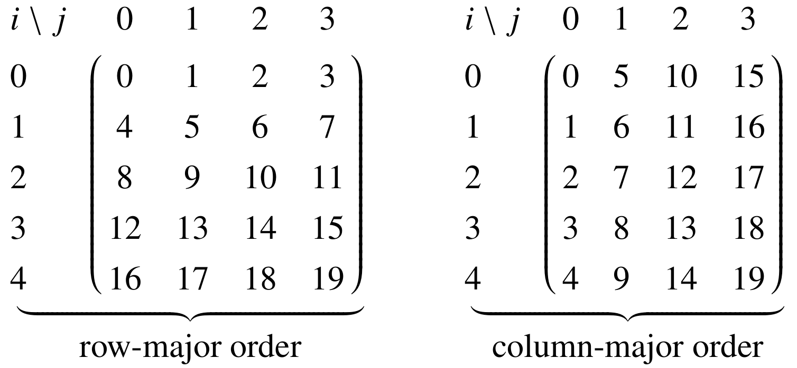
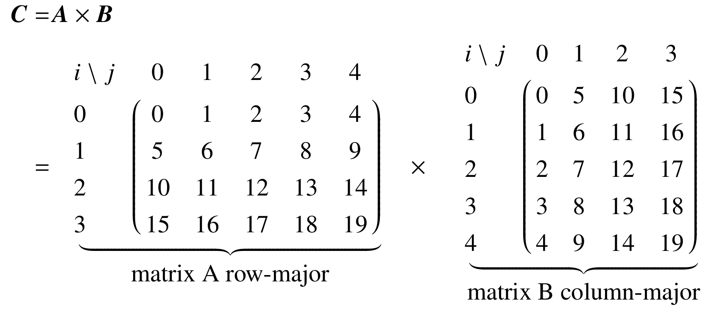

[](https://github.com/rehbergt/dgemm_test/actions) [](https://github.com/rehbergt/dgemm_test/actions)

# Writing R and Python Packages with Multithreaded C++ Code using BLAS, AVX2/AVX512, OpenMP, C++11 Threads and Cuda GPU acceleration

This tutorial shows step-by-step how to create an R and Python package which performs a naive matrix multiplication which uses just three for-loops. However, at each step more and more efficient low level CPU (and GPU) features are utilized. 
The focus of this tutorial is on showing how an existing algorithm can be ported from R or Python to C++ using BLAS functions,
AVX2/AVX512 vectorization (with runtime CPU feature detection), OpenMP and C++11 multithreading and CUDA. It is shown how these functions can be made easily accessible from R and python using foreign function interfaces and in particular be bundled as an R or Python package in order to make your code distributable. Moreover, it is shown how unit tests for each function can be implemented and how a CI system can be utilized.

**Each step of this tutorial is a separate branch** and the changes between each step can be viewed using git diff. For example for R:

    git diff step_1_R_basic_package..step_2_R_incorporating_C++

or for Python

    git diff step_1_Python_basic_package..step_2_Python_incorporating_C++


Note that this tutorial will not show you how to write the best matrix multiplication algorithm by hand (if you are looking for this [see here](http://apfel.mathematik.uni-ulm.de/~lehn/sghpc/gemm/)).

**Why R and Python Extensions?**

R and Python are easy to use and both are the state-of-art languages used in machine-learning.
Distributing your machine-learning method/algorithm as R and/or Python package ensures that a broad audience can easily use your method.

**Why Incorporating C/C++?**

Firstly, compiled code ensures a much better performance and secondly grants you access
to low level CPU features, which even further improve performance.
Thirdly, your algorithm becomes portable, meaning that the same C/C++ code can be incorporated in an R and Python package or even be used directly, which is also shown in the cpp folder using CMAKE and make.

**Comments, Hints and Improvement are appreciated, just create an issue or pull request!**


## **Tutorial overview:**

0. [**Installation of R and Python:**](#head0) The installation of R and Python/Numpy itself affects the performance. This section shows how to install R, Python/Numpy and how to
use/link optimized BLAS libraries.  

1. [**Creating a basic R and Python package:**](#head1) The first step shows the structure of an R/Python package and provides the first two matrix multiplication functions. The first function dgemm_R_loops()/dgemm_Python_loops() uses naive for-loops, while the second function dgemm_R_blas()/dgemm_Python_blas() uses built in functions, which are using the linked BLAS library. Moreover, documentation, unit tests and build tools are shown.

2. [**Foreign Function Interfaces (FFI):**](#head2) In this section a naive matrix multiplication written in C/C++ is incorporated into the package structure using FFIs.

3. [**BLAS:**](#head3) This sections shows how the DGEMM BLAS function can be directly called from C and how a BLAS library can be linked in the build process of the package.

4. [**AVX:**](#head4) Modern CPUs support vector instructions, which can significantly increase performance. In this section the naive C++ matrix multiplication is extended with AVX2/AVX512 intrinsics. Since the support of these instructions depends on the used CPU, a runtime detection and corresponding code path selection is shown.

5. [**Multithreading with OpenMP:**](#head5) The core count of modern CPUs is increasing more and more, especially of normal consumer CPUs. Thus, using all cores of a CPU is essential for getting the best performance. This section shows how a single line is enough to execute the AVX optimized matrix multiplication of the the previous section in parallel.

6. [**Multithreading with C++:**](#head6) Another way to execute the matrix multiplication in parallel is to use the mutlithreading functions indroduced in the C++11 standard. While this approach is more difficult to implement, it is more plattform independent since `OpenMP` is by default not available in the clang compiler on macOS.

7. [**GPU Cuda:**](#head7) naive for-loop matrix multiplication in CUDA (in single and double precision) and using cuBLAS


## <a name="head0"></a> **0. Installation of R/Python and BLAS Integration**
 The installation of R and Python/Numpy itself affects the performance. This section shows how to install R, Python/Numpy and how to
use/link optimized BLAS libraries.  
### **0.1 Basic Linear Algebra Subprograms (BLAS)**
* What is [BLAS](https://en.wikipedia.org/wiki/Basic_Linear_Algebra_Subprograms)?
    > "Basic Linear Algebra Subprograms is a specification that prescribes a set of 
    > low-level routines for performing common linear algebra operations such as 
    > vector addition, scalar multiplication, dot products, linear combinations, and 
    > matrix multiplication."
    > *Wikipedia*

* Different BLAS implementations optimized for specific hardware:
    1. [Intel Math Kernel Library (MKL)](https://software.intel.com/en-us/mkl): proprietary but very 
    efficient on Intel CPUs, [proprietary license but free to use](https://software.intel.com/en-us/license/intel-simplified-software-license)
    2. [BLIS](https://github.com/flame/blis): open source and BSD licensed and 
        recommended for AMD CPUs (zen optimized [fork by AMD](https://github.com/amd/blis))
    3. [OpenBLAS](https://github.com/xianyi/OpenBLAS): open source and
    [BSD licensed](https://github.com/xianyi/OpenBLAS/blob/develop/LICENSE)
    4. [NVBLAS:](https://docs.nvidia.com/cuda/nvblas) GPU accelerated BLAS library. Note: not to be confused with [cuBLAS](https://developer.nvidia.com/cublas).
    5. [cuBLAS](https://developer.nvidia.com/cublas), a special BLAS library which provides BLAS functions for Cuda code (shown in step 7).
    6. ...

### **0.2 BLAS and R/Python/Numpy**
* [**Anaconda**](https://www.anaconda.com/): This solution provides the Intel MKL for Python  by
    default. OpenBLAS can be installed but this might force a
    downgrade to older packages. Switching to OpenBLAS is possible by
    installing the `nomkl` package.
    As of 2019 Anaconda has switched from *Microsoft R Open* (using MKL) to R,
    which only uses a slower internal BLAS library.

* **Ubuntu and Debian** 
    1. **Installing a BLAS Library**

        In Ubuntu and Debian one can install an accelerated
    BLAS version from the repository and use `update-alternatives`
    to change the default BLAS implementation.
        * **Intel MKL:** Available in Ubuntu since 18.10 [(see)](https://launchpad.net/ubuntu/+source/intel-mkl)
            and in Debian since buster and stretch-backports [(see)](https://wiki.debian.org/DebianScience/LinearAlgebraLibraries):
            ```
            apt install intel-mkl
            ``` 

            Note that the intel MKL uses multithreading by default. However, this can be
            changed by the environment variable MKL_NUM_THREADS:
            ```
            export MKL_NUM_THREADS=1
            ```

            Intel provides a Debian/Ubuntu repository 
            with updated versions, which is also available for older Ubuntu/Debian releases [(see)](https://software.intel.com/en-us/articles/installing-intel-free-libs-and-python-apt-repo). A good guide for using this repository is written by D. Eddelbuettel and is available [here](https://github.com/eddelbuettel/mkl4deb). Note that this repository provides each version as a different package. Thus, the mkl package installed in this guide with `apt-get install intel-mkl-64bit-2018.2-046` 
            is outdated. One can install the current version with
            `apt-get install intel-mkl-64bit-2019.3-062`.

        * **BLIS:** Available in Ubuntu since 19.04 [(see)](https://launchpad.net/ubuntu/+source/blis)
            and in Debian since buster and stretch-backports [(see)](https://wiki.debian.org/DebianScience/LinearAlgebraLibraries):
            
            ```
            apt install libblis-dev
            ``` 
        
        * **OpenBLAS:**          
            ```
            apt install libopenblas-base libopenblas-dev
            ``` 
    
    2. **Selecting the default BLAS**
    
         Switching between the Libraries is possible using the update-alternatives mechanism.
        - Setting intel MKL default

            ```
            update-alternatives --set libblas.so-x86_64-linux-gnu      /usr/lib/x86_64-linux-gnu/libmkl_rt.so
            update-alternatives --set libblas.so.3-x86_64-linux-gnu    /usr/lib/x86_64-linux-gnu/libmkl_rt.so
            update-alternatives --set liblapack.so-x86_64-linux-gnu    /usr/lib/x86_64-linux-gnu/libmkl_rt.so
            update-alternatives --set liblapack.so.3-x86_64-linux-gnu  /usr/lib/x86_64-linux-gnu/libmkl_rt.so
            ```

        - Setting BLIS as default. BLIS does not provide LAPACK, thus one can use LAPACK from OpenBLAS

            ```
            update-alternatives --set libblas.so-x86_64-linux-gnu      /usr/lib/x86_64-linux-gnu/blis/libblas.so
            update-alternatives --set libblas.so.3-x86_64-linux-gnu    /usr/lib/x86_64-linux-gnu/blis/libblas.so.3
            update-alternatives --set liblapack.so-x86_64-linux-gnu    /usr/lib/x86_64-linux-gnu/openblas/liblapack.so
            update-alternatives --set liblapack.so.3-x86_64-linux-gnu  /usr/lib/x86_64-linux-gnu/openblas/liblapack.so.3
            ```

        - Setting OpenBLAS as default

            ```
            update-alternatives --set libblas.so-x86_64-linux-gnu      /usr/lib/x86_64-linux-gnu/openblas/libblas.so
            update-alternatives --set libblas.so.3-x86_64-linux-gnu    /usr/lib/x86_64-linux-gnu/openblas/libblas.so.3
            update-alternatives --set liblapack.so-x86_64-linux-gnu    /usr/lib/x86_64-linux-gnu/openblas/liblapack.so
            update-alternatives --set liblapack.so.3-x86_64-linux-gnu  /usr/lib/x86_64-linux-gnu/openblas/liblapack.so.3
            ```

    3. **Installing/Upgrading R and Python**
        * Installing R from the repository:
            ```  
            apt install r-base r-base-dev
            ```

          Installing Python from the repository:
            ```  
            apt install python3 python3-dev python3-pip
            ```
        
          Installing R dependencies:
            ``` 
            Rscript -e "install.packages(c('devtools', 'testthat'))"
            ``` 

          Installing Python Libraries used in this tutorial:
            ```  
            apt install python3-pip python3-numpy python3-pytest
            ```

        * Upgrading R: Ubuntu and Debian are stuck to the R version available during their package freeze. For example Ubuntu 18.04 provides uses 3.4.4. Fortunately, [cran repositories](https://cran.r-project.org/bin/linux) are available for Ubuntu, Debian and other distributions. 

        * Upgrading Python: Ubuntu and Debian are stuck to the Python version available during their package freeze.
        Upgrading the system version is however not recommended, since it is used by the system.
        Thus, using [Anaconda](https://www.anaconda.com/) or [pyenv](https://github.com/pyenv/pyenv) is encouraged if newer versions are necessary. A optimized numpy version using the intel MKL is available and can be installed via pip [intel-numpy](https://software.intel.com/en-us/articles/installing-the-intel-distribution-for-python-and-intel-performance-libraries-with-pip-and). 


* **Arch Linux:**

    Arch Linux provides MKL optimized packages for R and Python/Numpy in the AUR:
    * [r-mkl](https://aur.archlinux.org/packages/r-mkl/)
    * [python-numpy-mkl](https://aur.archlinux.org/packages/python-numpy-mkl/)

    Both depend on the Intel MKL AUR package [intel-mkl](https://aur.archlinux.org/packages/intel-mkl/)

* **Windows:**

    Using Anaconda is the only viable solution.

* **macOS - Any help on this would be very appreciated, since I am not familiar with macOS!** 

    Using anaconda is possible but macOS also supplies `vecLib` containing a BLAS implementation.
[R MacOSX FAQ](https://cran.r-project.org/bin/macosx/RMacOSX-FAQ.html#Which-BLAS-is-used-and-how-can-it-be-changed_003f)

### **0.3. Checking the linked BLAS library** 
* **R**
    ```
    Rscript -e "sessionInfo()"
    > sessionInfo()
    R version 3.5.3 (2019-03-11)
    Platform: x86_64-pc-linux-gnu (64-bit)
    Running under: Ubuntu 18.04.2 LTS

    Matrix products: default
    BLAS/LAPACK: /opt/intel/compilers_and_libraries_2019.2.187/linux/mkl/lib/intel64_lin/libmkl_rt.so

    locale:
     [1] LC_CTYPE=en_US.UTF-8       LC_NUMERIC=C              
     [3] LC_TIME=de_DE.UTF-8        LC_COLLATE=en_US.UTF-8    
     [5] LC_MONETARY=de_DE.UTF-8    LC_MESSAGES=en_US.UTF-8   
     [7] LC_PAPER=de_DE.UTF-8       LC_NAME=C                 
     [9] LC_ADDRESS=C               LC_TELEPHONE=C            
    [11] LC_MEASUREMENT=de_DE.UTF-8 LC_IDENTIFICATION=C       

    attached base packages:
    [1] stats     graphics  grDevices utils     datasets  methods   base     

    loaded via a namespace (and not attached):
    [1] compiler_3.5.3
    ```
* **Python** 
    ```
    python -c "import numpy; numpy.__config__.show()"
    > mkl_info:
    >     libraries = ['mkl_rt', 'pthread']
    >     library_dirs = ['/home/thorsten/anaconda3/envs/py/lib']
    >     define_macros = [('SCIPY_MKL_H', None), ('HAVE_CBLAS', None)]
    >     include_dirs = ['/home/thorsten/anaconda3/envs/py/include']
    > blas_mkl_info:
    >     libraries = ['mkl_rt', 'pthread']
    >     library_dirs = ['/home/thorsten/anaconda3/envs/py/lib']
    >     define_macros = [('SCIPY_MKL_H', None), ('HAVE_CBLAS', None)]
    >     include_dirs = ['/home/thorsten/anaconda3/envs/py/include']
    > blas_opt_info:
    >     libraries = ['mkl_rt', 'pthread']
    >     library_dirs = ['/home/thorsten/anaconda3/envs/py/lib']
    >     define_macros = [('SCIPY_MKL_H', None), ('HAVE_CBLAS', None)]
    >     include_dirs = ['/home/thorsten/anaconda3/envs/py/include']
    > lapack_mkl_info:
    >     libraries = ['mkl_rt', 'pthread']
    >     library_dirs = ['/home/thorsten/anaconda3/envs/py/lib']
    >     define_macros = [('SCIPY_MKL_H', None), ('HAVE_CBLAS', None)]
    >     include_dirs = ['/home/thorsten/anaconda3/envs/py/include']
    > lapack_opt_info:
    >     libraries = ['mkl_rt', 'pthread']
    >     library_dirs = ['/home/thorsten/anaconda3/envs/py/lib']
    >     define_macros = [('SCIPY_MKL_H', None), ('HAVE_CBLAS', None)]
    >     include_dirs = ['/home/thorsten/anaconda3/envs/py/include']
    ```


Exercise: Install R and an accelerate BLAS library and verify that the BLAS library is used.


## <a name="head1"></a> **1. Creating a basic R and Python package:**

The first step shows the structure of an R/Python package and provides the first two matrix multiplication functions. The first function dgemm_R_loops()/dgemm_Python_loops() uses naive for-loops, while the second function dgemm_R_blas()/dgemm_Python_blas() uses built in functions, which are using the linked BLAS library. Moreover, documentation, unit tests and build tools are shown.

View the structure of the R package
```
git checkout step_1_R_basic_package
```
View the structure of the Python package
```
git checkout step_1_Python_basic_package
```

### **1.1 File Structure**
While the structure of an R package has to follow a fixed specification, a Python package can
be arranged relatively freely. However, in order to make the R and Python package of this 
tutorial as comparable as possible both use a similar folder/file structure.

<center>
<table border="0">
 <tr>
    <td><b style="font-size:15px">R</b></td>
    <td><b style="font-size:15px">Python</b></td>
 </tr>
 <tr>
<td style="vertical-align: baseline;">
<pre>
dgemmR
├── DESCRIPTION
├── LICENSE
├── man
├── R
│   ├── dgemm_R_loops.R
│   └── dgemm_R_blas.R
├── src
│   └── for C/C++ files (added later)
└── tests
    ├── testthat.R
    └── testthat
        └── test_checkForEquality1.R
</pre>
</td>
<td style="vertical-align: baseline;">
<pre>
dgemmPy
├── setup.py
├── LICENSE
├── README.md
├── MANIFEST.in
├── dgemmPy
│   ├── __init__.py
│   ├── python
│   │   ├── __init__.py
│   │   ├── dgemm_py_loops.py
│   │   └── dgemm_py_blas.py
│   └── src
│       └── for C/C++ files (added later)
└── tests
    └── test_checkForEquality1.py
</pre>
</td>
</table>
</center>

**Important Points**
* **The name of the package:**
    * R: The name is defined by the name of the root folder and in the `DESCRIPTION` file.
    * Python: The name is defined by the name of the 1. subfolder containing the `__init__.py` file and in the `setup.py` file.
* **Metadata** like author, dependencies, version, license and compilation requirement:
    * R: stored in the `DESCRIPTION` file.
    * Python: stored in the `setup.py` file.
* **Functions:**
    * R: Stored in the `R` subfolder, exported using the `@export` roxygen2 annotation. 
    * Python: Stored in `python` subfolder, exported using the `__init__py` in the first subfolder.
* **Unit testing:**
    * R: unit testing can be performed using the R package [testthat](https://cran.r-project.org/web/packages/testthat/index.html). Tests are stored under tests/testthat and the file name must begin with 'test_'. Testing can be performed using the R package [devtools](https://cran.r-project.org/web/packages/devtools/index.html) by opening an R session in the dgemmR folder and using:
        ```
        devtools::test()
        ```
    * Python: unit tests can be performed using [pytest](https://docs.pytest.org).  
    Analogously as in R package, filenames must also begin with 'test_' and can be executed using in the subfolder dgemmPy:
        ```
        python -m pytest
        ```

* **Documentation:**
    * R: performed using the R package [roxygen2](https://cran.r-project.org/web/packages/roxygen2/index.html). Help files are automatically generated from annotation above a function definition and stored under degemmR/man. This automatic generation has to performed using the R package [devtools](https://cran.r-project.org/web/packages/devtools/index.html) by opening an R session in the dgemmR folder and using:
        ```
        devtools::build_vignettes()
        ```
    * Python: Functions can be annotated using docstrings using different styles. This tutorial follows the google docstring style.

* **Readme/Vignette:**
    * R: R package can be bundled with a vignette using [knitr](https://cran.r-project.org/web/packages/knitr/index.html) and [rmarkdown](https://cran.r-project.org/web/packages/rmarkdown/index.html). The file has to be stored in the folder dgemmR/vignettes. The compilation is automatically performed during the build process but can be manually performed using [devtools](https://cran.r-project.org/web/packages/devtools/index.html) by opening an R session in the dgemmR folder and using:
        ```
        pkgbuild::compile_dll() # necessary due to a devtools change
        devtools::document()
        ```
    * Python: A Readme/Vignette has to be supplied seperate. Only a long description can be included in the setup.py file (as shown in this example). 

* **Building Distributable Source Packages:**
    * R: open a shell in the root folder of this repository and run:
        ```
        R CMD build dgemmR
        ```
        This creates the `dgemmR_0.1.0.tar.gz` source R package, which can be installed using `R CMD INSTALL dgemmR_0.1.0.tar.gz`
    * Python: open a shell in the subfolder dgemmPy of this repository and run:
        ```
        python3 setup.py sdist
        ```
        This creates the `dgemmPy-0.0.1.tar.gz` source Python package in the dgemmPy/dist subfolder, which can be installed using `pip3 install ./dist/dgemmPy-0.0.1.tar.gz`.  Note that in `MANIFEST.in` the header files have to be manually added in order to bundle them in the source package.

* **Building Binary Packages:**
    **TODO**

* **Overall Conformance testing:**
    * R: There are multiple tests possible:

        1. Open a terminal in root folder and apply the following command on the previous build a source package (described above).
            ```
            R CMD check dgemmR_0.1.0.tar.gz
            ```
        2. The R package [devtools](https://cran.r-project.org/web/packages/devtools/index.html)  offers various other checks, which can be performed by opening an R session in the dgemmR folder and using:
            ```
            devtools::check()
            ```

    * Python:


## <a name="head2"></a> **2. Foreign Function Interfaces (FFI):** 
In this section a naive matrix multiplication written in C/C++ is incorporated into the package structure using FFIs.

View the changes for R:
```
git diff step_1_R_basic_package..step_2_R_incorporating_C++
```

View the changes for Python:
```
git diff step_1_Python_basic_package..step_2_Python_incorporating_C++
```

### **2.1 FFI Overview**

Using external functions (C/C++) in R and Python can be achieved in various ways. Here is a incomplete list of FFIs:
    
**List of frameworks for R ([see also writing R-Extension Guide](https://cran.r-project.org/doc/manuals/R-exts.html#System-and-foreign-language-interfaces)):**
- [.C/.Fortran:](https://cran.r-project.org/doc/manuals/R-exts.html#Interface-functions-_002eC-and-_002eFortran): Relatively low level, but each argument is copied!
- [.Call:](https://cran.r-project.org/doc/manuals/R-exts.html#Calling-_002eCall)
   Also low level but allows direct access of R objects and avoids copies. **Attention:** R uses copy-on-modify:
   ```
   a <- 1:5
   b <- a
   functionToDoubleInputUsingCall(a)
   print(a)
   [1]  2  4  6  8 10
   print(b)
   [1]  2  4  6  8 10
   ```
   can be avoided using `duplicate()`..
- [.External:](https://cran.r-project.org/doc/manuals/R-exts.html#Calling-_002eExternal)
    Very similar to `.Call` but less common
- [Rcpp](http://rcpp.org/): *high level* FFI, easy to use, allows copying objects from
    R to C/C++, allows calling R functions from C/C++. Not part of R itself and 
    thus is an additional dependency. Using R code from C/C++ can affect portability.

This tutorial thus uses `.Call` because the focus is a numerical applications and copying of matrices should be avoided. The *boilerplate code* necessary for `.Call` is not that much larger than using Rcpp and an additional dependency is avoided.

**List of frameworks for Python:**
- [ctypes](https://docs.python.org/3.7/library/ctypes.html)
- [CFFI](https://cffi.readthedocs.io/en/latest/)
- [Cython](https://cython.org/)
- [Boost.Python](https://www.boost.org/doc/libs/1_69_0/libs/python/doc/html/index.html)
- [C/C++ Extension](https://docs.python.org/3.7/extending/extending.html)

This tutorial uses the C/C++ extension approach in combination with the [NumPy C-API](https://docs.scipy.org/doc/numpy/reference/c-api.html) in order to avoid additional dependencies. Moreover, this approach is very similar to `.Call`.

### **2.2 Row-Major and Column-Major Matrix Representation**
There a two common ways to store a 2D array (matrix) in linear 1D memory.
<center>

</center> 

Problem: There is no general standard, which in this tutorial causes problems since R stores matrices in column-major order while numpy arrays (by-default) are stored in row-major order. However, the same C/C++ should be used in R and Python?

Solution used in this tutorial: Each element can be accessed using a small function implemented as macro 
(defined in `dgemm.h`), which is changed at compile-time to column or row-major order by supplying the global define COLUMN_MAJOR (default, if nothing is supplied, is row-major order). This functions takes 4 arguments i,j, number-of-rows, number-of-cols and returns the 1D memory position. 

Note that, despite only requiring the number-of-rows in the column-major case and vice-versa only requiring the number-of-cols in the row-major case both are supplied to the macro in order to use the same code.

## <a name="head3"></a> **3. BLAS:** 
This sections shows how the DGEMM BLAS functions can be called directly from C and how a BLAS library can be linked during the build process of the package.

**Note that the BLAS interface assumes matrices to be in column-major order!**

Different Levels:

* Level 1: vector operations
* Level 2: matrix-vector operations
* Level 3: matrix-matrix operations

A good overview of the different BLAS functions is available at
[netlib](http://www.netlib.org/blas/#_level_1) and
[here by Mark Gates](http://www.icl.utk.edu/~mgates3/docs/lapack.html)


## <a name="head4"></a> **4. AVX:** 
Modern CPUs support vector instructions, which can hugely increase performance. In this section the naive C++ matrix multiplication is extended with AVX2/AVX512 intrinsics. Since the support of these instructions depends on the used CPU, a runtime detection and corresponding code path selection is shown.

In order to be a more cache aware, matrix A is stored in row-major order while
matrix B is stored in column-major order:
<center>

</center> 
Thereby, the elements in the rows of A and columns of B - which have to be accessed for calculating one element of C - are adjacent.

One crucial aspect when using AVX intrinsics is that one has to provide fallback code
in order to guarantee that your code can also run on CPUs which do not support the corresponding instructions. For example AVX512 is only supported on skylake-x CPUs and code compiled with AVX512 instructions will crash on normal skylake or ryzen CPUs.
One possibility is to handle this is at compile time. However, in this tutorial AVX512 and AVX2 functions are separated in specific files and selected at runtime selected. 

Note that one has to compile the code with the corresponding flags. Compiling all code with AVX flags however, will cause that also other parts of your code will be auto-vectorized and will use AVX instructions. This might cause a  crash if your CPU does not support the instruction. Thus, this tutorial shows how to adjust the build system in order to compile *avx2.cpp files with AVX2 flags and *avx512.cpp files with AVX512 flags.


A every good tutorial about [number crunching with AVX by Matt Scarpino](https://www.codeproject.com/Articles/874396/Crunching-Numbers-with-AVX-and-AVX)

## <a name="head5"></a> **5. Multithreading with OpenMP:**
The core count of modern CPUs is increasing more and more, especially of normal consumer CPUs. Thus, using all cores of a CPU is essential for getting the best performance. This section shows how a single line is enough to execute the AVX optimized matrix multiplication of the the previous section in parallel.

## <a name="head6"></a> **6. Multithreading with C++:**
Another way to execute the matrix multiplication in parallel is to use the mutlithreading functions indroduced in the C++11 standard. While this approach is more difficult to implement, it is more plattform independent since `OpenMP` is by default not available in the clang compiler on macOS.


## <a name="head7"></a> **7. GPU-Acceleration** 
naive for loop matrix multiplication CUDA (in single and double precision) and using cuBLAS


